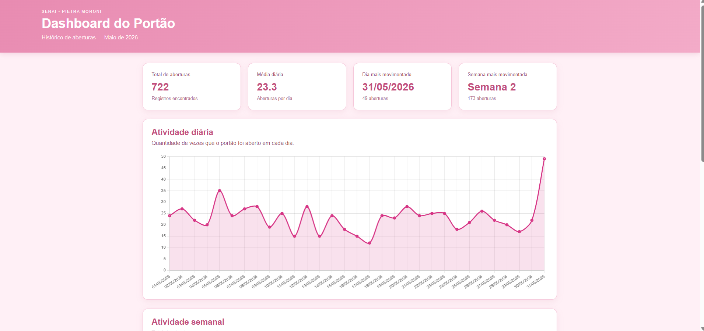
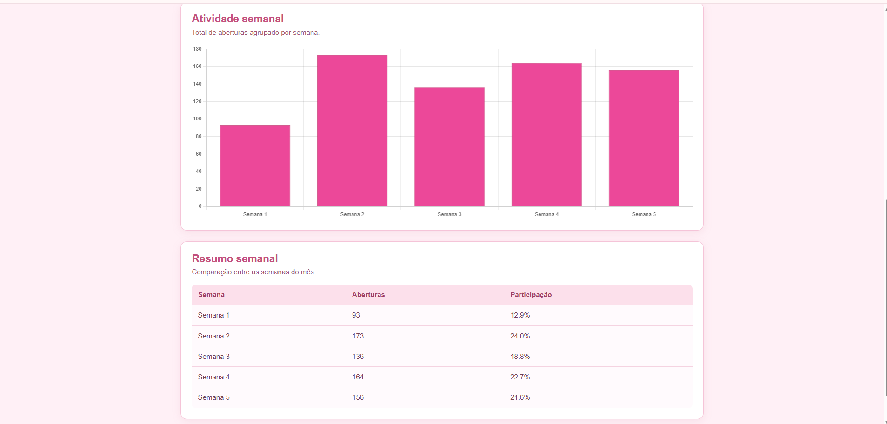

# AULA 2

## Simulação 01 — Trabalhando com mais alguns componentes

### Componentes e conhecimentos

* Transistores
* Transistor NPN
* Sensores
* Fotoresistor
* Botão 

### Print da atividade


### Explicação

O objetivo da atividade é utilizar um fotoresistor para controlar a intensidade de um LED de acordo com a quantidade de luz do ambiente. Com muita luz, a resistência diminui, fazendo com que a tensão na base do transistor fique baixa e o LED fique apagado ou fraco. No escuro, a resistência aumenta, elevando a tensão na base do transistor e fazendo o LED acender com mais intensidade.

---

## Simulação 02 — Circuito simples com interruptor e dois LEDs

### Componentes

* 1 Bateria de 9 V
* 1 Interruptor
* 2 LEDs, sendo vermelho e verde
* 2 resistores de 470 Ω

### Print da atividade


### Explicação

O objetivo da atividade é utilizar um interruptor para alternar o acionamento entre dois LEDs alimentados por uma bateria de 9V. Quando a chave é movida para um dos lados, ela fecha o circuito para o LED correspondente, permitindo a passagem de corrente e acendendo, enquanto o outro permanece apagado. Cada LED possui um resistor ligado em série para limitar a corrente vinda da bateria e evitar que o componente queime.

---

## Simulação 03 — Circuito utilizando capacitor

### Componentes

* 1 transistor NPN (BC548, BC547 ou 2N2222)
* 2 LEDs, sendo vermelho e verde
* 2 resistores de 470 Ω
* 1 resistor de 10 kΩ
* 1 capacitor eletrolítico de 470 µF a 1000 µF
* 1 bateria de 9 V

### Print da atividade


### Explicação

O objetivo da atividade é utilizar um transistor, um capacitor e LEDs para criar um circuito que produza um atraso na troca de estados das luzes. Ao ligar o circuito, o capacitor começa descarregado e demora alguns instantes para carregar, fazendo com que o LED verde permaneça aceso inicialmente. Conforme o capacitor carrega, o transistor passa a conduzir e o LED vermelho também acende. O tempo de atraso depende dos valores do resistor e do capacitor, sendo aproximadamente determinado pela relação entre R e C.


---

## Arduino UNO — Piscando as luzes

### Componentes

* 1 Arduino UNO
* 2 LEDs, sendo vermelho e verde
* 2 resistores de 470 Ω

### Código

```cpp
int verde = 8;
int vermelho = 2;

void setup()
{
  pinMode(verde, OUTPUT);
  pinMode(vermelho, OUTPUT);
}

void loop()
{
  digitalWrite(verde, 1);
  digitalWrite(vermelho, 0);
  delay(1000);
  digitalWrite(verde, 0);
  digitalWrite(vermelho, 1);
  delay(1000);
}
```

### Print da atividade


### Explicação

O objetivo da atividade é utilizar o Arduino para controlar dois LEDs, sendo o verde conectado à porta digital 8 e o vermelho à porta digital 2. O programa faz com que os LEDs acendam de forma alternada, com um intervalo de 1 segundo entre cada troca. 


---

# AULA 3

## Situação Problema 01 — Semáforo de duas vias

### Componentes

* 6 LEDs
  * 2 verdes
  * 2 amarelos
  * 2 vermelhos
* 6 resistores de 150 Ω
* Arduino UNO

### Desafio

Desenvolver dois semáforos controlados pelo mesmo Arduino UNO, garantindo que funcionem de forma sincronizada e que os dois semáforos não fiquem verdes ao mesmo tempo.
Também foram acrescentados dois LEDs para simular a travessia de pedestres. O semáforo de pedestres deve ficar verde apenas quando o semáforo de veículos estiver vermelho.

### Código

```cpp
// Semáforo 1
int vermelho1 = 8;
int amarelo1 = 9;
int verde1 = 10;

// Semáforo 2
int vermelho2 = 13;
int amarelo2 = 12;
int verde2 = 11;

// LED vermelho e verde
int vermelho3 = 3;
int verde3 = 4;

void setup() {

  pinMode(vermelho1, OUTPUT);
  pinMode(amarelo1, OUTPUT);
  pinMode(verde1, OUTPUT);

  pinMode(vermelho2, OUTPUT);
  pinMode(amarelo2, OUTPUT);
  pinMode(verde2, OUTPUT);

  pinMode(vermelho3, OUTPUT);
  pinMode(verde3, OUTPUT);
}

void loop() {

  // SEMÁFORO 1 VERDE
  digitalWrite(verde1, HIGH);
  digitalWrite(amarelo1, LOW);
  digitalWrite(vermelho1, LOW);

  digitalWrite(verde2, LOW);
  digitalWrite(amarelo2, LOW);
  digitalWrite(vermelho2, HIGH);

  digitalWrite(verde3, LOW);
  digitalWrite(vermelho3, HIGH);

  delay(2500);

  // SEMÁFORO 1 AMARELO
  digitalWrite(verde1, LOW);
  digitalWrite(amarelo1, HIGH);
  digitalWrite(vermelho1, LOW);

  digitalWrite(verde2, LOW);
  digitalWrite(amarelo2, LOW);
  digitalWrite(vermelho2, HIGH);

  digitalWrite(verde3, LOW);
  digitalWrite(vermelho3, HIGH);

  delay(500);

  // SEMÁFORO 2 VERDE
  digitalWrite(verde1, LOW);
  digitalWrite(amarelo1, LOW);
  digitalWrite(vermelho1, HIGH);

  digitalWrite(verde2, HIGH);
  digitalWrite(amarelo2, LOW);
  digitalWrite(vermelho2, LOW);

  digitalWrite(verde3, HIGH);
  digitalWrite(vermelho3, LOW);

  delay(2500);

  // SEMÁFORO 2 AMARELO
  digitalWrite(verde1, LOW);
  digitalWrite(amarelo1, LOW);
  digitalWrite(vermelho1, HIGH);

  digitalWrite(verde2, LOW);
  digitalWrite(amarelo2, HIGH);
  digitalWrite(vermelho2, LOW);

  digitalWrite(verde3, HIGH);
  digitalWrite(vermelho3, LOW);

  delay(500);
}
```

### Print da atividade


### Explicação

O objetivo da atividade é desenvolver dois semáforos controlados por um Arduino, simulando um cruzamento da portaria. Os semáforos devem funcionar de forma sincronizada, com o verde aceso por 2,5 segundos, o amarelo por 0,5 segundo e o vermelho por 3 segundos, garantindo que os dois sinais verdes nunca fiquem acesos ao mesmo tempo. Também são adicionados dois LEDs para representar a travessia de pedestres, permitindo que o sinal verde para pedestres acenda somente quando o semáforo de veículos estiver vermelho.

---

## Situação Problema 02 — Acendendo as luzes da pista de pouso

### Componentes

* 1 fotoresistor
* 1 resistor de 10 kΩ
* 10 LEDs
* 10 resistores de 470 Ω
* Arduino UNO

### Desafio

Construir um circuito utilizando um fotoresistor e 10 LEDs. Conforme a luminosidade aumenta, a quantidade de LEDs acesos deve diminuir.

### Código

```cpp
int fotoresistor = A0;

int leds[] = {
  2, 3, 4, 5, 6,
  7, 8, 9, 10, 11
};

void setup() {
  for (int i = 0; i < 10; i++) {
    pinMode(leds[i], OUTPUT);
  }
}

void loop() {

  int luz = analogRead(fotoresistor);

  int quantidade = map(luz, 0, 600, 0, 10);

  quantidade = constrain(quantidade, 0, 10);

  for (int i = 0; i < 10; i++) {
    if (i < quantidade) {
      digitalWrite(leds[i], HIGH);
    } else {
      digitalWrite(leds[i], LOW);
    }
  }

  delay(50);
}
```

### Print da atividade


### Explicação

O objetivo da atividade é utilizar um fotoresistor para identificar a quantidade de luminosidade do ambiente e controlar automaticamente as luzes de uma pista de pouso. O circuito utiliza 10 LEDs, que devem permanecer acesos quando estiver escuro, garantindo a iluminação da pista, e vão se apagando gradualmente conforme a luminosidade aumenta. Dessa forma, o projeto demonstra como um sensor pode ser utilizado para automatizar a iluminação de acordo com as condições do ambiente.


---

# AULA 4

## Experimento 01 — Controlando um Micro Servo

### Componentes

* Arduino UNO
* Micro Servo
* Potenciômetro de 1 kΩ
* Capacitor de 100 mF

### Desafio

Controlar o movimento do Micro Servo de acordo com a posição do potenciômetro.

### Código

```cpp
#include <Servo.h>

Servo meuServo;

const int pinoPotenciometro = A0;
const int pinoServo = 11;

int valorPotenciometro = 0;
int anguloServo = 0;

void setup() {
  meuServo.attach(pinoServo);
}

void loop() {
  valorPotenciometro = analogRead(pinoPotenciometro);
  anguloServo = map(valorPotenciometro, 0, 1023, 0, 180);
  meuServo.write(anguloServo);
  delay(15);
}
```

### Print da atividade


### Explicação

O objetivo da atividade é controlar um micro servo motor utilizando um Arduino e um potenciômetro de 1 kΩ. Ao girar o potenciômetro, o Arduino realiza a leitura da posição e transforma esse valor em um ângulo de rotação para o servo motor, permitindo controlar seu movimento de forma proporcional. A atividade também utiliza um capacitor para auxiliar na estabilidade do circuito.


---

## Experimento 02 — Visor de sete segmentos

### Componentes

* Arduino UNO
* Display de 7 segmentos
* 8 resistores de 470 Ω
* 1 resistor de 4,7 kΩ
* 1 botão

### Desafio

Desenvolver um contador de 0 a 9. A cada acionamento do botão, o número apresentado no display deve ser alterado.

### Código

```cpp
int a = 4, b = 5, c = 6, d = 7, e = 8, f = 9, g = 10;
int botao = 2;
int num = 0;
int entrada[7] = {a,b,c,d,e,f,g};
int display[10][7] = {{a,b,c,d,e,f},{b,c},{a,b,d,e,g},{a,b,c,d,g},{b,c,f,g},{a,c,d,f,g},{a,c,d,e,f,g},{a,b,c},{a,b,c,d,e,f,g},{a,b,c,f,g}};

void setup() {
  for(int i=0;i<7;i++) pinMode(entrada[i],OUTPUT);
  pinMode(botao,INPUT);
}

void loop() {
  int click = digitalRead(botao);
  delay(100);
  if(click) num++;
  if(num < 10) numero(num); else num = 0;
}

void numero(int coluna) {
  for(int i=0;i<7;i++) digitalWrite(entrada[i],1);
  for(int linha=0;linha<7;linha++){
    digitalWrite(display[coluna][linha],0);
  }
}
```

### Print da atividade


### Explicação

O objetivo da atividade é utilizar um Arduino conectado a um display de sete segmentos para criar um contador de 0 a 9. A cada acionamento do botão, o valor exibido é incrementado, permitindo compreender como controlar individualmente os segmentos de um display. 

---

# SITUAÇÃO DESAFIADORA — PORTÃO ELETRÔNICO

## Contextualização

Nesta situação foi proposta a criação de um sistema de automação industrial para controlar um portão eletrônico.
A ideia é utilizar um microcontrolador para realizar o controle do portão e, futuramente, permitir que os dados de acionamento sejam enviados pela internet para gerar relatórios sobre a utilização do equipamento.

## Desafio

Os componentes utilizados são:

* Placa de ensaio pequena
* Arduino UNO R3
* Bateria de 9 V
* Motor CC
* 2 relês DPDT
* 3 botões
* 3 resistores de 1 kΩ
* 1 LED vermelho
* 1 LED verde

### Atividades

1. Montar no simulador um protótipo semelhante ao modelo apresentado.
2. Utilizar um Arduino UNO para controlar o acionamento do portão.
3. Desenvolver o código de controle.
4. Acrescentar LEDs vermelho e verde para representar a sinalização da saída da garagem.

### Código

```cpp
const int BTN_ESQUERDA = 2;
const int BTN_MEIO = 12;
const int BTN_DIREITA = 8;

const int RELAY_POWER = 13;
const int RELAY_DIR = 11;

const int LED_VERMELHO = 10;
const int LED_VERDE = 9;

bool sistemaLigado = false;
bool direcaoMotor = LOW;

bool ultimoEstadoMeio = LOW;
bool ultimoEstadoDireita = LOW;

void setup() {
  pinMode(BTN_ESQUERDA, INPUT);
  pinMode(BTN_MEIO, INPUT);
  pinMode(BTN_DIREITA, INPUT);

  pinMode(RELAY_POWER, OUTPUT);
  pinMode(RELAY_DIR, OUTPUT);
  pinMode(LED_VERMELHO, OUTPUT);
  pinMode(LED_VERDE, OUTPUT);

  digitalWrite(RELAY_POWER, LOW);
  digitalWrite(RELAY_DIR, LOW);
  digitalWrite(LED_VERMELHO, LOW);
  digitalWrite(LED_VERDE, LOW);
}

void loop() {
  bool btnMeio = digitalRead(BTN_MEIO);
  bool btnEsq = digitalRead(BTN_ESQUERDA);
  bool btnDir = digitalRead(BTN_DIREITA);

  if (btnMeio == HIGH && ultimoEstadoMeio == LOW) {
    sistemaLigado = !sistemaLigado;

    if (sistemaLigado) {
      digitalWrite(RELAY_POWER, HIGH);
      digitalWrite(RELAY_DIR, direcaoMotor);
      digitalWrite(LED_VERMELHO, HIGH);
      digitalWrite(LED_VERDE, HIGH);
    } else {
      digitalWrite(RELAY_POWER, LOW);
      digitalWrite(LED_VERMELHO, LOW);
      digitalWrite(LED_VERDE, LOW);
    }

    delay(200);
  }

  ultimoEstadoMeio = btnMeio;

  if (sistemaLigado) {

    if (btnEsq == HIGH) {
      digitalWrite(LED_VERMELHO, HIGH);
      digitalWrite(LED_VERDE, LOW);
    }

    if (btnDir == HIGH && ultimoEstadoDireita == LOW) {
      direcaoMotor = !direcaoMotor;
      digitalWrite(RELAY_DIR, direcaoMotor);

      digitalWrite(LED_VERMELHO, LOW);
      digitalWrite(LED_VERDE, HIGH);

      delay(200);
    }

    ultimoEstadoDireita = btnDir;
  }
}
```

### Print da atividade


### Observação

O objetivo da atividade é desenvolver um protótipo de um portão eletrônico utilizando Arduino  motor , relês e botões, simulando o acionamento de abertura e fechamento do portão. Além disso, foram adicionados LEDs vermelho e verde para sinalizar o funcionamento da saída da garagem, piscando de forma alternada. 

**Observação:** o código desta atividade está **levemente errado**, pois durante a simulação ocorreu um erro que fez o sistema travar e, por isso, não foi possível realizar os testes e corrigir completamente o funcionamento. Como a atividade já foi passada para o professor, assim que o problema for identificado e solucionado, o código será corrigido e atualizado.


---

# ANÁLISE DE DADOS — WEB UI

## Conhecimentos

### 6. Interfaces com elementos visuais interativos

#### 6.1 Linguagens

* HTML
* CSS
* JavaScript

#### 6.2 Aplicações

* Visualização de Dados
* Interatividade

---

# Situação Desafiadora — Dashboard do Portão

## Contextualização

Após concluir o protótipo do portão com Arduino, foi possível controlar o funcionamento do portão. Porém, utilizando um microcontrolador com conexão à rede, como o ESP32, seria possível enviar os dados de abertura e fechamento para um banco de dados.
Com esses dados seria possível gerar informações importantes para a gestão, como quantidade de acionamentos por dia, semana, mês e ano.

## Desafio

Foi disponibilizado um arquivo `dados.csv` contendo registros referentes ao histórico de abertura do portão durante o mês de maio de 2026.
A partir desses dados foi desenvolvida uma interface Web com um Dashboard para apresentar as informações de maneira visual.

O Dashboard apresenta:

* Total de aberturas
* Média diária
* Dia mais movimentado
* Semana mais movimentada
* Gráfico de atividade diária
* Gráfico de atividade semanal
* Tabela com o resumo semanal

## Tecnologias utilizadas

* HTML5
* CSS3
* JavaScript
* Chart.js

## Dashboard

O Dashboard foi desenvolvido utilizando HTML para estruturar a página, CSS para criar a aparência visual da interface e JavaScript para processar os dados e gerar os gráficos.

### Acessar o Dashboard

🌐 **GitHub Pages:** [Clique aqui para acessar o Dashboard](https://piemoroni.github.io/dashbord_iot/)

### Print — Dashboard




### Explicação

O Dashboard transforma os registros do arquivo `dados.csv` em informações visuais.
O primeiro gráfico apresenta a quantidade de aberturas do portão em cada dia do mês. O segundo gráfico agrupa os registros por semana, permitindo comparar o movimento durante o mês.
Além dos gráficos, foram criados cartões com informações resumidas e uma tabela mostrando a quantidade de aberturas e a participação de cada semana no total.

---

# Como testar

## Estrutura dos arquivos

```text
dashboard-portao/
├── index.html
├── style.css
└── script.js
```

## Executar o projeto

Abra a pasta do projeto no Visual Studio Code.

Depois, abra o arquivo `index.html` no navegador.

Também pode ser utilizado o Live Server do Visual Studio Code para executar a página.

## Conferir o Dashboard

Ao abrir a página, devem aparecer:

* Os cartões de informações
* O gráfico diário
* O gráfico semanal
* A tabela de resumo semanal

Os dados são processados automaticamente pelo JavaScript.

---

# Conclusão

Durante as atividades foram desenvolvidos conhecimentos relacionados à eletrônica, automação, Arduino e desenvolvimento Web.
As simulações permitiram trabalhar com componentes como LEDs, resistores, transistores, sensores, fotoresistores, capacitores, servomotores e displays de sete segmentos.
Também foi desenvolvido um projeto de automação de um portão eletrônico utilizando Arduino UNO e relês.
Na etapa de análise de dados, os registros do portão foram utilizados para criar um Dashboard Web capaz de apresentar as informações de forma visual, utilizando HTML, CSS, JavaScript e Chart.js.
Por Pietra Moroni :)
